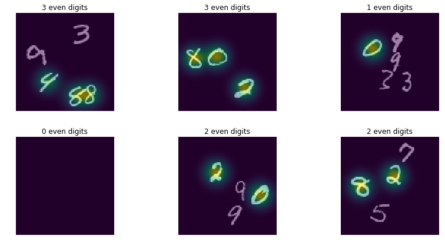

# Counting MNIST

A simple synthetic dataset and baseline model for visual counting. The task is to count the number of even digits given a 100x100 image, each with up to 5 randomly chosen MNIST digits. We use rejection sampling to ensure digits are separated by at least 28 pixels. Reproduced with details from [Learning to count with deep object features](https://arxiv.org/abs/1505.08082).

**NOTE:** This is not a dataset to beat, but a simple place to start for validating ideas in counting models.



## Instructions

1. Generate TFRecords:

```
python -m counting_mnist.create_dataset
```

2. Train baseline:

```
python -m counting_mnist.main
```

## Results

| Accuracy | Model |
| --- | --- |
| 33.1% | Zeros |
| 12.5% | Uniform |
| 85.3% | Baseline |
